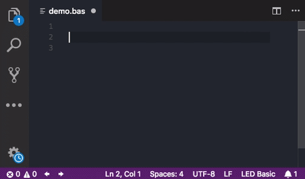

# VS Code LED Basic language support

This extension adds LED Basic support for Visual Studio Code.

## Features
- LED Basic V15.1.14 support
- Basic Syntax highlighting
- Code snippets: `for/ford`
- Smart Bracket support
- Hover symbol information
- Code completion support
- Intial diagnostics support based on code validation using language grammar parser
- Jump to label
- Shows all references to a label

## Issues
Please report problems and feature requests on [github](https://github.com/Gamadril/led-basic-vscode/issues)

## Licence
MIT license, see [LICENSE](./LICENSE)

